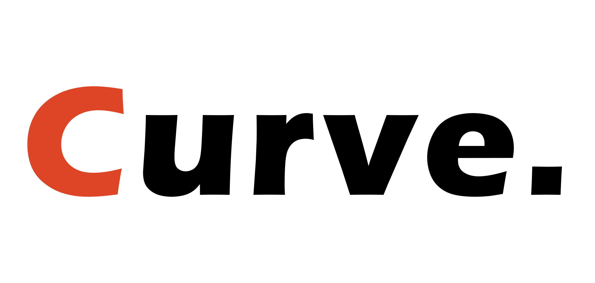

# Curve - Blogging Website

> Building a bloggling website.

This is an informative website for users to publish writeups on different espects. Users are able to create accounts, create posts and manage them. 

## Built With

- Bootstrap
- Laravel

## Live Demo

[Live Demo Link](https://github.com/csbasic/curve)

## Getting Started

To get a local copy up and running follow these simple example steps.

Setup Git on your local environment to enable you clone the this project source code.

Setup Composer for the integration external dependencies and libraries for this Laravel project.

Setup a local production environment with `Wampserver or Xamppserver` for Winders,  `Nginx or xamppserver` for Ubuntu and Mac.

Clone the repo with `git clone https://github.com/csbasic/curve`

Create a database named `curve` for simplicity or you might want to change the database name.

Set the `Environmental Varables` on the env file found in this project.

Run `php artisan migrate` on the command line to publish all the schema to the database.

Run `php artisan serve` to start the server. It will run on localhost: 127.0.0.1 and on port: 8000.

Run `127.0.0.1:8000` to view the website. 

The app is deployed using GitHub pages. You can view it using the 'live demo' above.

## Author

👤 **Chi Serge**

- GitHub: [@githubhandle](https://github.com/csbasic)
- X: [@xhandle](https://twitter.com/chiserge_/)
- LinkedIn: [LinkedIn](https://www.linkedin.com/in/chiserge/)

## Acknowledgments

- A special thanks to Sir Collins for guidance and Instructions. Checkout his Github profile  [@CollinsTatang](https://github.com/CollinsTatang).

## 📝 License

The Laravel framework is open-sourced software licensed under the [MIT license](https://opensource.org/licenses/MIT).
